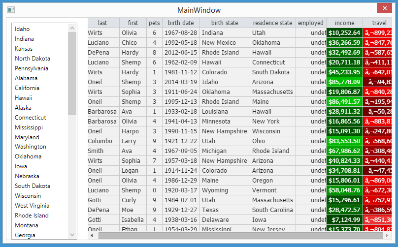

# embedding-wpf-demo
This is a demo application that leverages the OpenFin EmbeddedView API to embed a OpenFin window in a Microsoft WPF Application.

## Install
Clone this project

To install dependencies run the following these instructions [NuGet Package Restore](http://docs.nuget.org/consume/package-restore)

You should be able to build and run the project.
